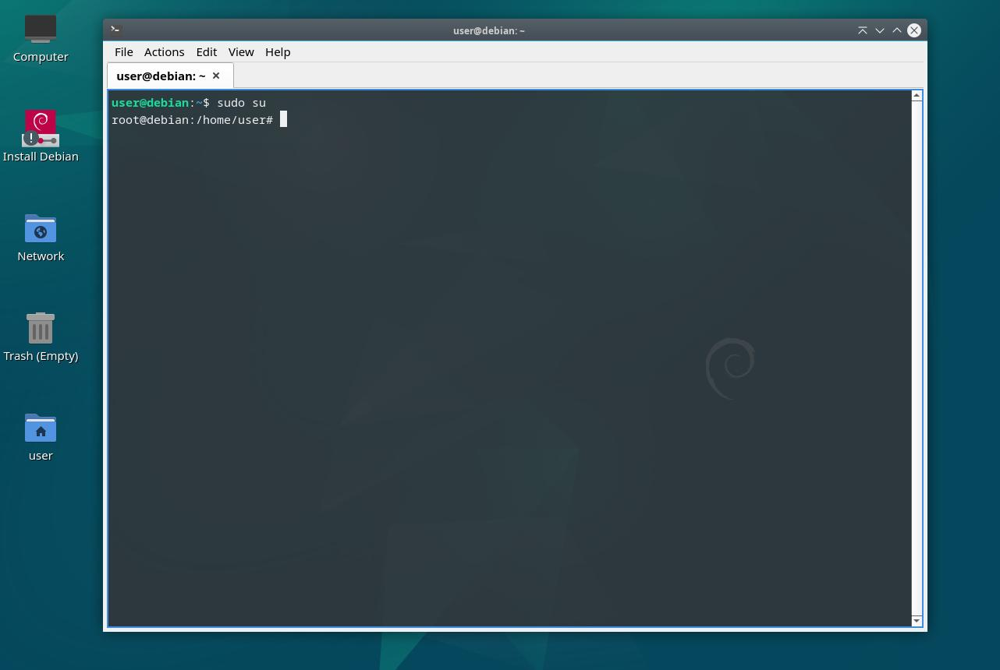

# (Holloway) Chew Kean Ho's Actualizer

[](#)

Tired of bloated OS images and cumbersome installers? Want to build the
smallest possible Debian OS while preserving full upstream compliance and
trust? Meet **Actualizer — a simple, single shell script solution designed to
empower developers and embedded engineers to create lean, secure, upstream
compliant, and customizable Debian operating systems from the ground up.**

Unlike traditional Debian ISO installers, Actualizer strips away the excess.
Leveraging Debian's `debootstrap` and rigorous curation, it constructs a
terminal-only, near-bare-metal OS with an uncompromised Chain of Trust to the
upstream Debian repositories. Perfect for embedded systems, IoT devices, or
high-performance server/desktop environments, Actualizer delivers:

1. **Ultra-Minimal Footprint** - Remove all non-essential packages—no GUI,
    no bloat, just a pristine Debian core.
2. **Upstream Compliance** - Maintain 100% compatibility with Debian’s
   ecosystem while ensuring security and auditability.
3. **Embedded-First Design** - Optimized for resource-constrained hardware,
   yet scalable for desktop/server use cases.
4. **Transparent & Reproducible** - A single script, operable via Debian Live
   ISO, ensures simplicity and reproducibility for developers.

Join my community-driven movement to redefine minimalism in Debian.

Build smaller. Build smarter. Build with (Holloway) Chew, Kean Ho's Actualizer.

> **WARNING DISCLAIMER**
>
> Actualizer is **NOT** for the faint of heart. Designed for OS engineers
> and Linux veterans, it requires comfort with terminal-only interfaces and
> manual system customization. But for those who demand absolute control over
> their stack, Actualizer unlocks unparalleled efficiency and trust.
>
> Here's how an end product looks like in QEMU:
>
> [](#)


## Technical Features

[](#)

Acutalizer is an user-prompting automata script so you are required to response
on screen setup accordingly. Otherwise, you're good!

Here are the base features installed using this script into your target:

* **Tri-Partitions** - `EFI` (UEFI,1G), `BOOT` (LEGACY,1G), `CORE` (DATASTORE,100%FREE)
* **Single Architecture** - depending on your selected Live OS DVD. Only 1
                            is installed.
* **Cryptsetup Datastore** - `CORE` partition is encrypted with the latest
                             acceptable algorithm.
* **LVM Disk Management** - `CORE` partition is managed by `lvm` inside the
                             cryptsetup encrypted layer for data integrity &
                             maintenances.
* **SecureBoot Enabled** - supported by default.
* **Single Language** - only 1 language installed.
* **Single Keyboard Configuration** - only 1 keyboard configuration installed.
* **Wifi + Ethernet Basic Network** - basic wifi (`iwd`) and ethernet
                                      (`connman`) network (`iproute2`)
                                      configuration.
* **No Text Editor** - Install only your desired one on your own.
* **NFTables Firewall** - Latest Linux firewall.
* **Track Stable Upstream**  - Using `stable` against
                               `https://deb.debian.org/debian/`.
* **Track Stable Security**  - Using `stable-security` against
                               `https://security.debian.org/debian-security`
* **Track Stable Updates**   - Using `stable-updates` against
                               `https://deb.debian.org/debian/`.
* **Track Stable Backports** - Using `stable-backports` against
                              `https://deb.debian.org/debian/`.
* **Enables `contrib`** - Enables `contrib` series by default.
* **Enables `non-free`** - Enables `non-free` series by default.
* **Enables `non-free-firmware`** - Enables `non-free-firmware` series by
                                    default.
* **Using Debian Signed Kernel** - Only uses signed kernel for
                                   SecureBoot (Security).
* **Using Debian Signed Bootloader** - Only uses signed bootloader for
                                       SecureBoot (Security).
* **Configured `/etc/hostname`** - hostname configured for network from the
                                   get-go.
* **Create 1 non-sudo User** - create 1 non-sudo User with home directory by
                               default.
* **Configure root User** - configure root user for basic security.
* **No Swap Partition/File** - for SecureBoot (security).
* **Debian CA Certificates Installed** - for seamless secured network
                                         connectivity.
* **Debian APT HTTPS Transport Installed** - for securing upstream supply chain.
* **No Sudo package** - Reduces attack surfaces using 1 root and 1 non-root
                        accounts only. (security).
* **Set Default Timezone** - Configure default timezone.


## How-to Use

[](#)


### 1. Boot the Debian Live DVD (not Installer) ISO

You need to download the Debian Live DVD (not the Installer DVD). When booted
up, it **MUST** show **Live Boot Option**. Otherwise, you got the wrong image
so please procure the right one.

[](#)


Available URLs:

* **Debian Live DVD Official Page** - https://www.debian.org/CD/live/
* **Debian Live DVD Wiki Page** - https://wiki.debian.org/DebianLive
* **Debian Live DVD (amd64) ISO Repository** - https://cdimage.debian.org/debian-cd/current-live/amd64/iso-hybrid/

This is better than the installer DVD because if you're looking for a new
hardware but unsure about Debian support. This live DVD stick can boot up a
genuine Debian and you can use `lspci -k` to check all hardware+drivers
support (make sure all devices has a driver running).

Moreover, the same stick can act as a recovery stick in the future if you
did something wrong.


### 2. Switch to Root Account

Once you're on the live DVD, switch to root account by simply running the
following command (no password required):

```
$ sudo su
```

[](#)


### 3. Download the Script

Go to root directory and proceed to download a copy of the script from one of
my release servers across the globe:

```
$ cd /
$ curl --tlsv1.2 --location --output "/actualizer.sh" --url [URL]
```

Available URLs:

* **Zenodo (Global)** - `https://zenodo.org/records/15353619/files/debian-minbase-install.sh?download=1`
* **GitHub (Global)** - `https://github.com/ChewKeanHo/Actualizer/releases/download/[VERSION]/debian-minbase-install.sh`


### 4. Run the Script

Now that we have the script available for execution, proceed to run it. This
script will tell you what is required on-screen (e.g. what dependencies are
missing, checking qualified cryptography random generator, etc). Please
respond accordingly throughout the session. From steps to steps, the script
will let you know when it will take a long time so you can work on other stuff.

> **SIDE-NOTE**:
>
> For dependencies, you can safely do `$ apt install debootstrap -y` before
> executing the script. For some reason, Debian did not ship that package
> enabled by default.

```
$ chmod +x ./actualizer.sh   # NOTE: Run once to make it executable
$ ./actualizer.sh
```

[](#)


### 5. Post-Installation

Congratulations. You now have a smallest possible Debian OS.
**Keep that Debian Live DVD stick for future recovery stick or shopping use**.
Example:

1. https://wiki.debian.org/GrubEFIReinstallOnLUKS (default)
2. https://wiki.debian.org/GrubEFIReinstall

If you need to install desktop manager (e.g. GNOME, KDE, LXQt (my go-to)), you
can checkout the Debian Wiki to crawl back. However, for safety, you should
perform the following:

```
$ apt install dialog sudo -y
```

This project pushes Debian OS to the edge cases so some packages may fail
because of dependencies listing blindspot. Please **RESPECT** the maintainer
and report back accordingly.


## Maintainers' Supports

[](#)

You can procure my sponsorship token here
(https://www.hollowaykeanho.com/en/stores/). Financial supports are always
appreciated.


### Technical Requirements

To be determined. Right now, its CI build infrasturcture and documentations
must be up first before anything else. Stay tuned.


## License

[](#)

Actualizer is licensed under
[(Holloway) Chew, Kean Ho's Liberal License](LICENSE.txt).
